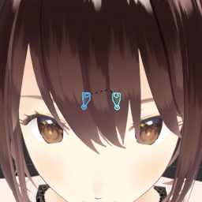

# VRM To Rigify Metarig

Generate Rigify armature and metarig from VRM model

## Requirements

1. [Blender 3.6](https://www.blender.org/download/lts/) or earlier version (does not work on 4.0 and above)
2. [VRM Add-on for Blender](https://vrm-addon-for-blender.info/en/)

## Installation

1. Download `vrm_to_rigify_metarig.zip` from releases page.
2. Install the addon in Blender at `Edit` > `Preferences` > `Add-ons`.
3. Tick the box to enable the addon.

## Usage

### Generate metarig and Rigify rig

1. Import a VRM model using VRM Add-on for Blender (`File` > `Import` > `VRM`).
2. Select the imported armature model.
3. Open 3D viewport sidebar panel (press N).
4. Go to `VRM To Rigify Metarig` tab.
5. Click `One-Click Setup`.

### Regenerate Rigify rig

If the metarig and the Rigify rig has already been generated, you can make changes to the metarig and regenerate the Rigify rig.

To regenerate the Rigify rig:

1. Select the metarig. The `One-Click Setup` button will change to `Regenerate`.
2. Click `Regenerate`.

You can regenerate using Rigify's own control, but by doing so, you will missing out on the post-generate setup like unused bones removal and eye direction fix.

### Eye direction and recalibration

The eye bones generated by VRoid Studio are not aligned to the eye meshes. This will cause the eye to not track the eye control bone.

This addon will try to fix the eye direction by using the middle point of the iris mesh. However, some models have a weird shape of iris mesh causing the pupil to not be in the middle. Therefore, this addon provides a utility to recalibrate the eye direction manually.

To recalibrate the eye direction:

1. Position 3D Cursor right at the pupil of the **LEFT** eye (`Shift`+`RMB` for default keymapping, `LMB` for right-click select keymapping).
    - You can also go to edit mode and select the vertex (or vertices) that is located at the pupil. Then, snap the cursor (`Mesh` > `Snap` > `Cursor to Selected`).
    - Another way is to create an empty and adjust the position of the empty to the pupil, then snap the 3D cursor to it (`Object` > `Snap` > `Cursor to Selected`).
2. Click `Recalibrate Eye Direction` under `Utilities` panel.

### Other utilities

1. Enable/disable IK stretch for all limbs.
2. Hide/show toon shader. Useful for low performance hardware.
3. Show default/show all control layers.

## License

MIT License
